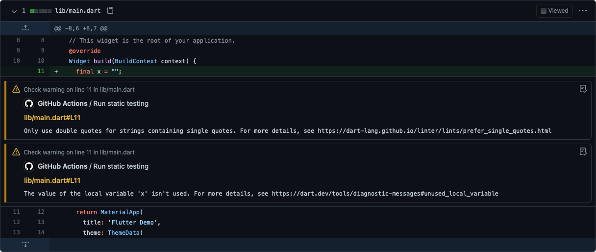

# GitHub Action — Analyze Dart

This GitHub Action (written in JavaScript) allows you to leverage GitHub Actions to analyze your Dart project's Dart code, including Flutter. This runs both the `dart analyze` and `dartfmt` commands under the hood.

## Usage
### Pre-requisites
Create a workflow `.yml` file in your `.github/workflows` directory. An [example workflow](#common-workflow) is available below. For more information, reference the GitHub Help Documentation for [Creating a workflow file](https://help.github.com/en/articles/configuring-a-workflow#creating-a-workflow-file).

### Inputs
For more information on these inputs, see the [Workflow syntax for GitHub Actions](https://docs.github.com/actions/reference/workflow-syntax-for-github-actions#jobsjob_idstepswith)

- `fail-on-warnings`: The action fails if any warning was found. This will always fail on errors. Optional. Default: `false`
- `working-directory`: The working directory. Optional. Default: `./`
- `line-length`: The maximum line length. Optional. The formatter will use its default: `80`

### Outputs
None.

Sample Workflow Summary:


Sample Files Changed:


### Dart workflow

1. Your workflow must install Dart before using this action. Suggestion: [Dart starter workflow](https://github.com/actions/starter-workflows/blob/main/ci/dart.yml).
2. Use the action. For example:
```yaml
on: push

name: Sample Workflow

jobs:
  build:
    name: Example
    runs-on: ubuntu-latest
    container:
      image:  google/dart:latest
    steps:
      - name: Checkout code
        uses: actions/checkout@v2
      - name: Install dependencies
        run: dart pub get
      - name: Analyze Dart
        uses: zgosalvez/github-actions-analyze-dart@v1
```

### Flutter workflow

1. Your workflow must install Flutter before using this action. Suggestion: [Flutter action](https://github.com/marketplace/actions/flutter-action).
2. Use the action. For example:
```yaml
on: push

name: Sample Workflow

jobs:
  build:
    name: Example
    runs-on: ubuntu-latest
    steps:
      - name: Checkout code
        uses: actions/checkout@v2
      - name: Set up Flutter
        uses: subosito/flutter-action@v1
      - run: flutter pub get
      - name: Analyze Dart
        uses: zgosalvez/github-actions-analyze-dart@v1
```

### Custom Workflow

After following the [common workflow](#common-workflow) above, lint rules can be customized. For more details see:
- [`pedantic`](https://github.com/dart-lang/pedantic) for rules enforced internally at Google
- [`effective_dart`](https://github.com/tenhobi/effective_dart) for rules corresponding to the [Effective Dart](https://dart.dev/guides/language/effective-dart) style guide
- [`flutter`](https://github.com/flutter/flutter/blob/master/packages/flutter/lib/analysis_options_user.yaml) for rules used in `flutter analyze`

### Flutter Workflows

This is used in my opinionated [GitHub Actions: Flutter Workflows](https://github.com/zgosalvez/github-actions-flutter-workflows) repository along with other actions for a complete end-to-end DevOps experience.

## License
The scripts and documentation in this project are released under the [MIT License](LICENSE)